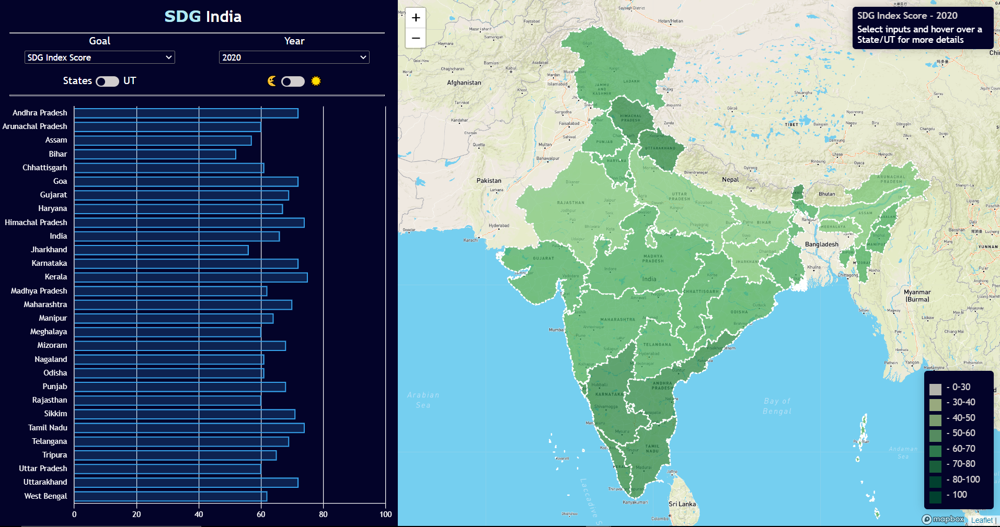

# SDG India

React application to display Sustainable Development Goals (SDGs) data for Indian states using bar chart and map for the years 2018-2020.

- It is developed using `React` frontend and `Redux` for state management with JSON data from inside the application.
- It comes with theme controls and optimized for viewing in small devices.
- It uses `Chartjs` for bar chart and `Leaflet` for Map which fetches map data from `Mapbox` api.

## Live website hosted at Heroku

[SDG India](https://sdg-india.herokuapp.com/)

## Install

Install the dependencies with the following command:

```shell
npm install
```

## Launch with Development Server

To run a development build and launch the development server, execute:

```shell
npm start
```

Once completed, the app should be avialable from http://localhost:3000/

## Application UI

<div align="center">
   <br/>
   
   <br/>
   <br/>
</div>

## Extending SDG data

Add JSON of new data in `src/data/` and add the year in YEARS variable in `src/config/index.js`

## GeoJSON path

Updated GeoJSON can be loaded in `public/assets/` with the same name in future
